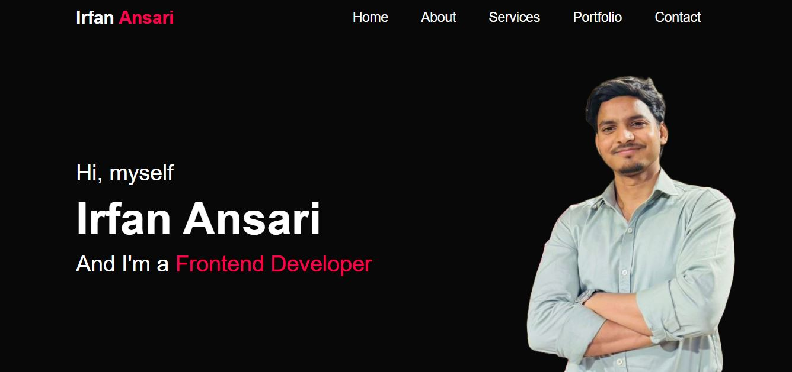

# Personal Portfolio Website

This is my personal portfolio website where I showcase my front-end development projects, skills, and learning journey. It is built using modern web technologies with a focus on clean design and responsive layout.

---

## Overview

This portfolio highlights my work as a beginner front-end developer. It includes multiple projects from Frontend Mentor along with information about my skills and services.

---

## Links

* Live Site URL: [https://irfanansari21.github.io/personal-portfolio-website/]
* GitHub Repository: [https://github.com/IrfanAnsari21/personal-portfolio-website]

---

## Screenshot

---

## Built with

* HTML5
* CSS3
* JavaScript
* Responsive design

---

## Features

* Responsive design for all screen sizes
* Clean and modern UI
* Projects showcase section
* Services section
* Interactive elements using JavaScript

---

## What I learned

* How to structure a complete portfolio website
* Improved my CSS layout and responsive design skills
* How to organize multiple sections in a single page
* Gained confidence in building real-world projects

---

## Challenges I faced

* Designing a clean and user-friendly layout
* Managing responsiveness across devices
* Structuring content properly for better readability
* Keeping the design simple yet attractive

---

## Continued development

* Improve UI/UX design skills
* Add more advanced JavaScript features
* Learn React and upgrade this portfolio in the future

---

## Author

* Frontend Mentor - [@IrfanAnsari21](https://www.frontendmentor.io/profile/IrfanAnsari21)
* GitHub - [@IrfanAnsari21](https://github.com/IrfanAnsari21)

---

## Acknowledgments

This portfolio is part of my learning journey as a front-end developer, where I practiced building real-world projects and improving my skills.
